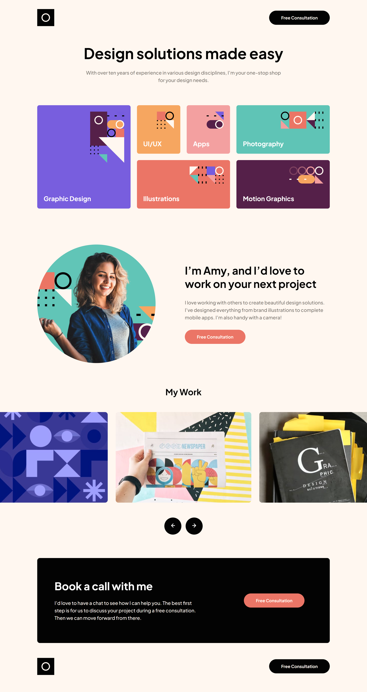

# Frontend Mentor - Single-page design portfolio solution

This is a solution to the [Single-page design portfolio challenge on Frontend Mentor](https://www.frontendmentor.io/challenges/singlepage-design-portfolio-2MMhyhfKVo). Frontend Mentor challenges help you improve your coding skills by building realistic projects.

## Table of contents

-   [Overview](#overview)
    -   [The challenge](#the-challenge)
    -   [Screenshot](#screenshot)
    -   [Links](#links)
-   [My process](#my-process)
    -   [Built with](#built-with)
    -   [What I learned](#what-i-learned)
-   [Author](#author)

## Overview

### The challenge

Users should be able to:

-   View the optimal layout for the site depending on their device's screen size
-   See hover states for all interactive elements on the page
-   Navigate the slider using either their mouse/trackpad or keyboard

### Screenshot

### Links

-   Solution URL: [Solution URL](https://github.com/Andro87/single-page-design-portfolio-project.git)
-   Live Site URL: [Live site URL ](https://single-page-design-portfolio-project.vercel.app/)

## My process

### Built with

-   Semantic HTML5 markup
-   CSS custom properties
-   Flexbox
-   CSS Grid
-   Mobile-first workflow
-   [React](https://reactjs.org/) - JS library
-   [Next.js](https://nextjs.org/) - React framework

### What I learned

The project tested my knowledge of CSS Grid and helped me to strengthen my layout skills.
It was challenging to decide which strategies to adopt to achieve the best result and to keep the code clean and maintainable.
Even if the design was simple in general, there were parts which required particular attention (the slide and the "table" of skills, for example), especially in making the site responsive.
It was great to work on this challenge.

## Author

-   Frontend Mentor - [@Andro87](https://www.frontendmentor.io/profile/Andro87)
